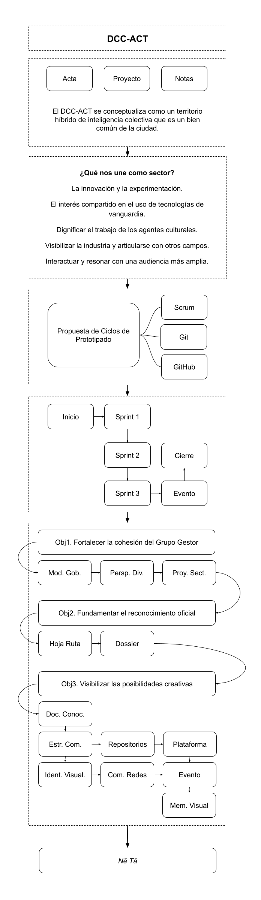

# Prototipo del DCC-ACT

## Concepto de partida

El DCC-ACT se conceptualiza como un territorio híbrido de inteligencia colectiva que es un bien común de la ciudad. El DCC-ACT se guía por los principios abiertos, distribuidos y convivenciales que favorecen el acceso e integración de todas las personas que desde una perspectiva cultural se interesan en articularse de manera creativa con la exploración del campo de la convergencia en arte, ciencia y tecnología.

### Investigación, gobernanza y comunicación

La conceptualización de lo que significa un Distrito Creativo Convergente en Arte, Ciencia y Tecnología en el marco de la ciudad actual nos permite a mediano plazo «fundamentar el reconocimiento oficial del DCC-ACT» (Obj2).

Desde esta conceptualización, El DCC-ACT se configura por medio de un proceso colaborativo de gobernanza y comunicación que tiene como fin «fortalecer la cohesión del Grupo Gestor del DCC-ACT» (Obj1).

### Desarrollo y producción

El DCC-ACT se activa en la ciudad por medio de un evento de lanzamiento que se realiza en tres espacios abiertos a comunidades locales y otros agentes del sector. Este es un evento híbrido (análogo-digital) que tiene como propósito «visibilizar las posibilidades creativas del DCC-ACT» (Obj3).

## Funcionalidades generales

### 1. Investigación

* Fun1.1. Hoja de ruta
* Fun1.2. _Nē Tā_ de conocimiento situado
* Fun1.3. Dossier del DCC-ACT
* Fun1.4. Documentación de perfiles DCC-ACT

### 2. Gobernanza

* Fun2.1. Modelo de gobernanza
* Fun2.2. Perspectiva de diversidad cultural
* Fun2.3. Proyección sectorial

### 3. Comunicación

* Fun3.1. Estrategia de comunicación
* Fun3.2. Identidad visual
* Fun3.3. Comunicación en redes

### 4. Desarrollo

* Fun4.1. Plataforma digital
* Fun4.2. Repositorios abiertos

### 5. Evento

* Fun5.1. Evento de lanzamiento
* Fun5.2. Memoria audiovisual

## Punto de partida

## Marco de trabajo

El DCC-ACT busca articular conocimientos y prácticas diversas en procesos colaborativos de investigación-creación-acción. Esto implica poder trabajar colectivamente en proyectos abiertos, iterativos y en constante transformación, donde la comunicación, la trazabilidad y la adaptación son esenciales.

Por esta razón, para el prototipado del DCC-ACT utilizaremos Scrum, Discord y GitHub como herramientas que nos permiten diseñar la convergencia desde la propia convergencia de conocimientos.

Se busca con esta infraestructura promover la transparencia y la ética colaborativa, en la cual cada contribución es visible, trazable y puede ser discutida públicamente.

## Esquema iterativo

## Ciclos

- **Inicio** -> 10 oct - 20 oct
  
- **Sprint  1** -> 21 oct - 31 oct
- **Sprint  2**  -> 04 nov - 14 nov
- **Sprint  3**  -> 18 nov - 28 nov

- **Cierre**  ->  01 dic - 12 dic

### Inicio

**Duración:** 10 oct - 20 oct

**Alcance:**
* A0.1. Creación de la organización y los repositorios en GitHub.
* A0.2. Definición de roles del equipo.
* A0.3. Creación de la guía Scrum, Discord y GitHub.
* A0.4. Preparación de la Hoja de Ruta (v0.1).
* A0.5. Definición del Backlog inicial.

**Resultados:**
* [R0.1.](inicio/esquema-repositorios.md) Organización y repositorios en GitHub.  -> Responsable: Desarrollo e Investigación.
* [R0.2.](inicio/roles-equipo.md) Roles del equipo.  -> Responsable: Coordinadores.
* [R0.3.](inicio/guia-contribucion.md) Guía Scrum, Discord y GitHub. -> Responsable: Investigación, Desarrollo y Comunicación.
* [R0.4.](inicio/hoja-de-ruta.md) Hoja de ruta (v0.1). -> Responsable: Investigación.
* [R0.5.](inicio/documentacion-requisitos.md) Seguimiento en GitHub Projects del Backlog inicial.  -> Responsable: Coordinadores.
