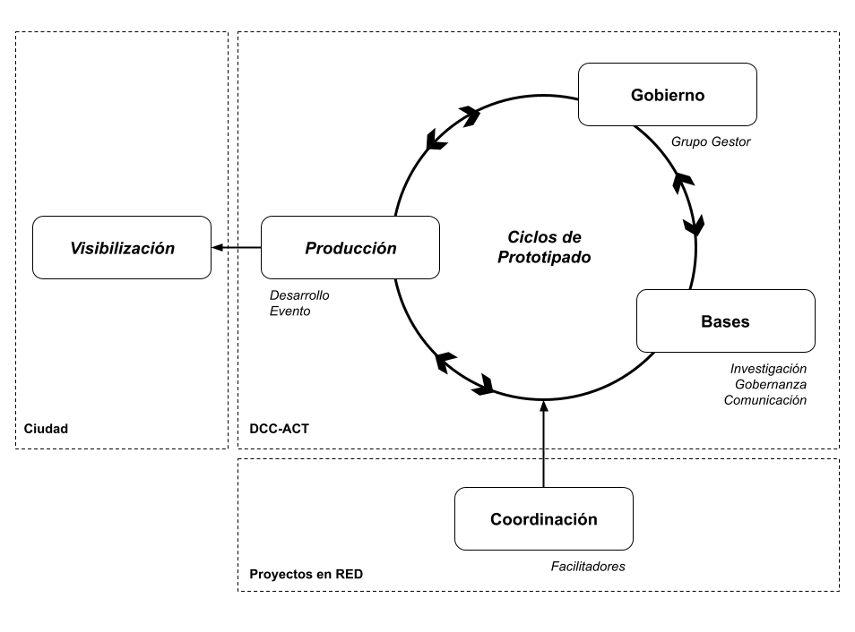

# Primera fase del prototipo del DCC-ACT

## Concepto de partida

El DCC-ACT se conceptualiza como un territorio híbrido de inteligencia colectiva que es un bien común de la ciudad. El DCC-ACT se guía por los principios abiertos, distribuidos y convivenciales que favorecen el acceso e integración de todas las personas que desde una perspectiva cultural se interesan en articularse de manera creativa con la exploración del campo de la convergencia en arte, ciencia y tecnología.

### Investigación, gobernanza y comunicación

La conceptualización de lo que significa un Distrito Creativo Convergente en Arte, Ciencia y Tecnología en el marco de la ciudad actual nos permite a mediano plazo «fundamentar el reconocimiento oficial del DCC-ACT» (Obj2).

Desde esta conceptualización, El DCC-ACT se configura por medio de un proceso colaborativo de gobernanza y comunicación que tiene como fin «fortalecer la cohesión del Grupo Gestor del DCC-ACT» (Obj1).

### Desarrollo y producción

El DCC-ACT se activa en la ciudad por medio de un evento de lanzamiento que se realiza en tres espacios abiertos a comunidades locales y otros agentes del sector. Este es un evento híbrido (análogo-digital) que tiene como propósito «visibilizar las posibilidades creativas del DCC-ACT» (Obj3).

## Funcionalidades según los objetivos

### 1. Fundamentación

* Fun1.1. Dossier del DCC-ACT

### 2. Cohesión

* Fun2.1. Modelo de gobernanza

### 3. Visibilización

* Fun3.1. Visibilización de perfiles DCC-ACT
* Fun3.2. Estrategia de comunicación
* Fun3.3. Comunicación visual y redes

### 4. Producción

* Fun4.1. Plataforma digital y repositorios abiertos
* Fun4.2. Evento de visibilización
* Fun4.3. Memoria audiovisual

## Punto de partida

## Marco de trabajo

El DCC-ACT busca articular conocimientos y prácticas diversas en procesos colaborativos de investigación-creación-acción. Esto implica poder trabajar colectivamente en proyectos abiertos, iterativos y en constante transformación, donde la comunicación, la trazabilidad y la adaptación son esenciales.

## Esquema iterativo

## Ciclos primera fase

- **Inicio** - > 28 oct

- **Ciclo  1** -> 29 oct - 10 nov
- **Ciclo  2**  -> 11 nov - 24 nov
- **Ciclo  3**  -> 25 nov - 04 dic

- **Cierre** -> 05 dic

### Inicio

**Alcance:**
* A0.1. Creación de la organización y los repositorios en GitHub.
* A0.2. Definición de roles del equipo.

**Resultados:**
* [R0.1.](inicio/esquema-repositorios.md) Organización y repositorios en GitHub.  -> Responsable: Desarrollo e Investigación.
* [R0.2.](inicio/roles-equipo.md) Roles del equipo.  -> Responsable: Coordinadores.
